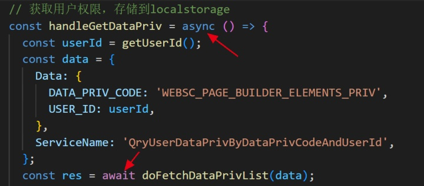

看到这里。有关async和await的知识点有点记不清了，于是去学习了下。

**async用于声明一个函数为异步处理函数**

除此声明外，函数的写法和同步函数没什么区别，它返回的是一个Promise对象，而Promise是用来干嘛的，他是用于解决异步问题（比如回调地狱）的异步操作的对象，它本身不是异步的，你使用它的时候他会立即执行，但是他会等到你需要的结果才会返回结果；

**await意味着等待一个异步函数的执行结果**

它必须写在async内部，也就是暂停当前async的语句执行，让async先等一下，等到await后面的异步函数执行完后，再继续执行语句。