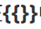
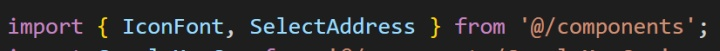
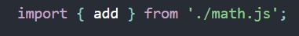
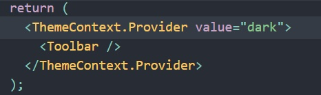
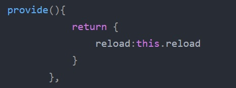
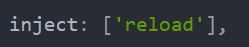
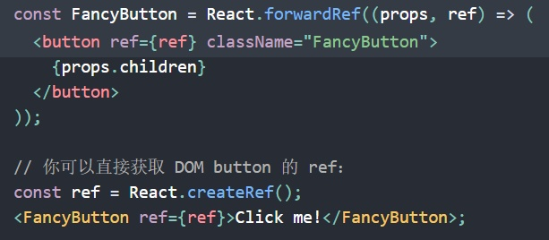

## React & Vue细节比较：

##### 最大的不同是语法模板的编写

react是通过JSX渲染模板。而vue是通过一种拓展的HTML语法进行渲染：vue看起来更像是已经给你搭建好了房子，你所做的只需要把它装饰得更美丽；而react更像搭积木，偏向于将功能一个一个组件化独立出来。

**除了框架本质的不一样**，两者之间还有许多不一样的地方，比如：

**渲染过程**--在vue中可以只单独渲染发生变化的组件，但是react需要将所有组件重新渲染；

**数据流**--在vue中通过v-model可以实现数据的双向绑定，而react中仅有单向数据流；

**数据监听**--vue中通过比较算法（diff）比较VDOM，监听变化的dom，但是如果没有设立设置key进行过程优化，可能会有大量VDOM重新渲染，然而react就不会发生此类情况，因为react强调数据的不可变。

当然除了不同以外，vue和react还有许多**相似的地方**：

都支持**组件化开发**、都有**VDOM**、都**支持props进行父子组件通信**等。

****

#### 基础比较：

**React**

1. 在**{}**中使用表达式or变量
2. 主要使用**JS语法**进行条件渲染
3. 数据流**单向**且自上而下传递：通过**状态提升**(即将需要共享的state移动到最近的共同父组件中)达到共享数据源的目的
4. 推广了VDOM并创造了新的语法--**JSX**，允许开发者在js中书写HTML
5. props对于子组件来说是必须的，因为它依赖一个**单一数据源作为它的状态**；使用map()进行循环赋值/创建节点
6. 父子组件数据通信主要采用props；跨层级组件传递数据主要通过context。特别是在子组件向父组件传递数据时一般采用**回调函数**
7. 创建应用使用**create-react-app脚手架**
8. 需要使用**setState方法**去更新状态

**Vue**

1. 在中使用表达式or变量
2. 主要使用**模板语法**v-if/v-show进行条件渲染
3. 数据**双向**绑定：通过**v-model语法糖**实现数据的双向绑定
4. 使用的模版是普通的**HTML**，通过Vue来整合现有的系统是比较容易的，不需要整体重构
5. 与props略有不同，他们一样是在组件中被定义，但**Vue依赖于模版语法**，可以通过v-for循环更高效地展示传入的数据等
6. 父子组件传值主要使用props/$emit通信、获取属性和方法主要使用$refs/ref+$children/$parent；兄弟组件数据通信主要使用新建Vue实例通过$emit/$on+eventBus通信；跨层级组件间的通信主要使用provide/inject通信。特别是在子组件向父组件传递数据时一般采用**事件**
7. 创建应用使用**vue-cli脚手架**
8. Vue中state对象并不是必须的，数据由data属性在Vue对象中进行管理，通过计算属性/深度监视中的**getter&setter方法**更新data属性

**Import：React与Vue中Import的含义类似，用法有略微不同**

- vue中的import只能用于导入组件/工具之类的文件

- react的import不仅可以导入组件和工具文件，还可以导入某个组件的某个功能函数，如下：add()为math.js中的一个功能函数

 

**Context ：React和Vue中都引入了provide的概念**

- react中，context用于简化值层层传递所有组件的繁琐，常用API有React.createContext/Context.Provider/Classs.contextType/Context.Consumer/Context.displayName

 

- vue中，数据之间的层层传递通常使用provide+inject进行

父组件

 

子组件

 

**Refs：React中与Vue中均有Refs转发的概念，用法也基本一致**

refs主要用于将ref自动地通过组件传递到其一子组件的技巧。对于大多数应用中的组件来说，这通常不是必需的。但其对某些组件，尤其是可重用的组件库是很有用的。

**注意：**　

1. ref 加在普通的元素上，用this.$refs.（ref值） 获取到的是dom元素
2. ref 加在子组件上，用this.$refs.（ref值） 获取到的是组件实例，可以使用组件的所有方法。在使用方法的时候直接this.$refs.(ref值).方法()就可以使用了

