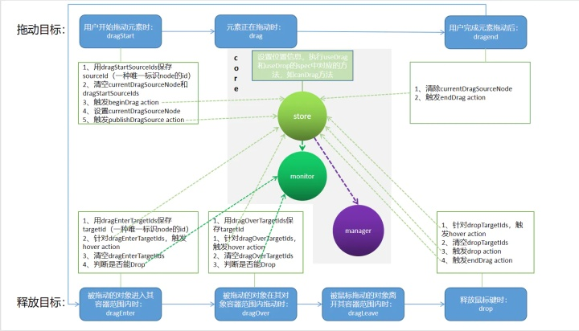
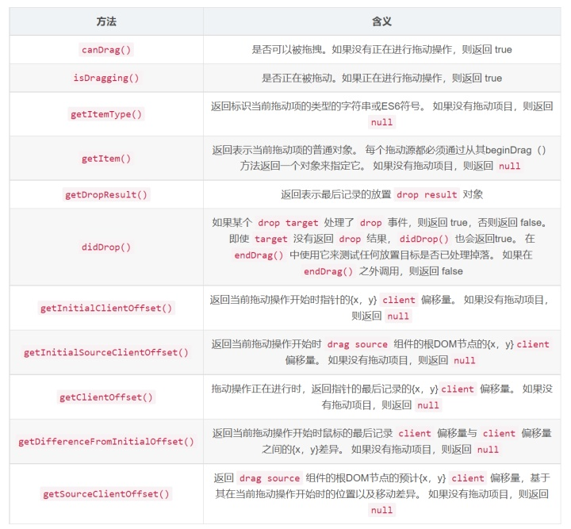
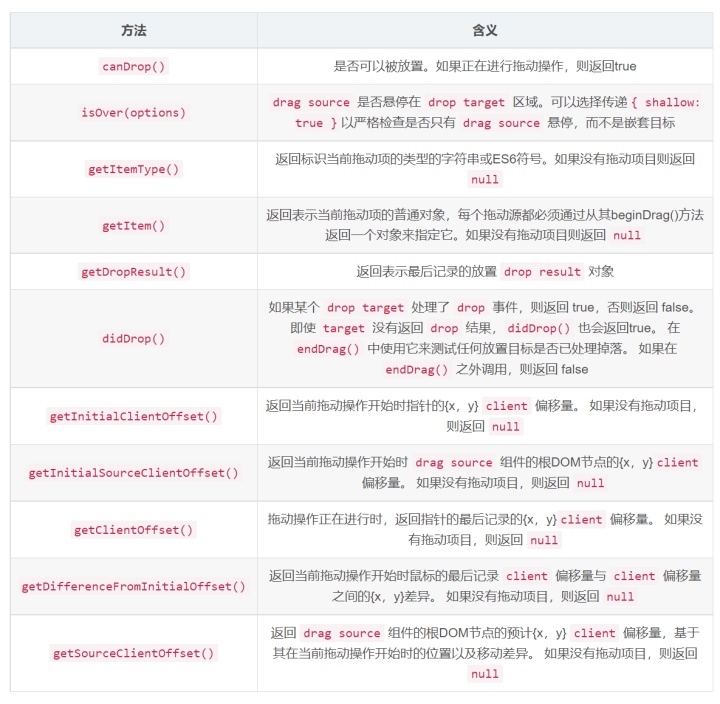
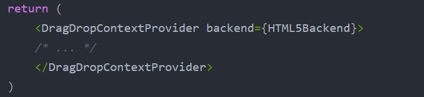
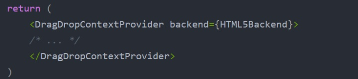
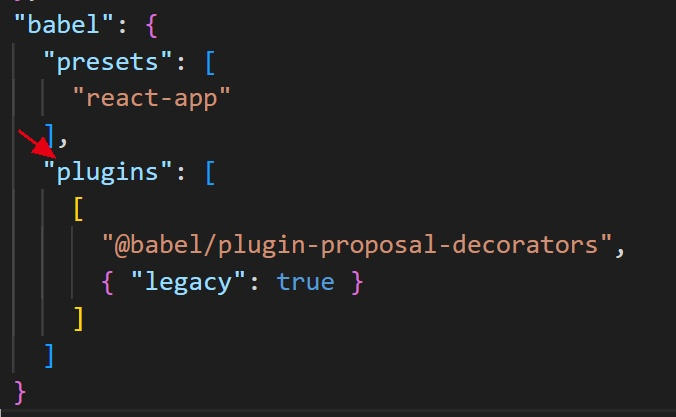
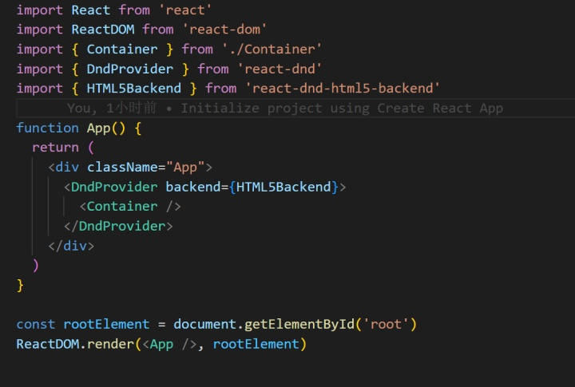
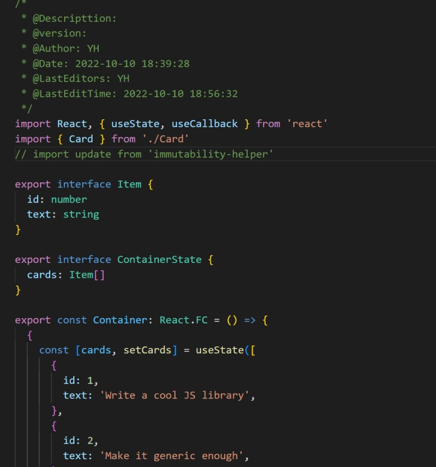
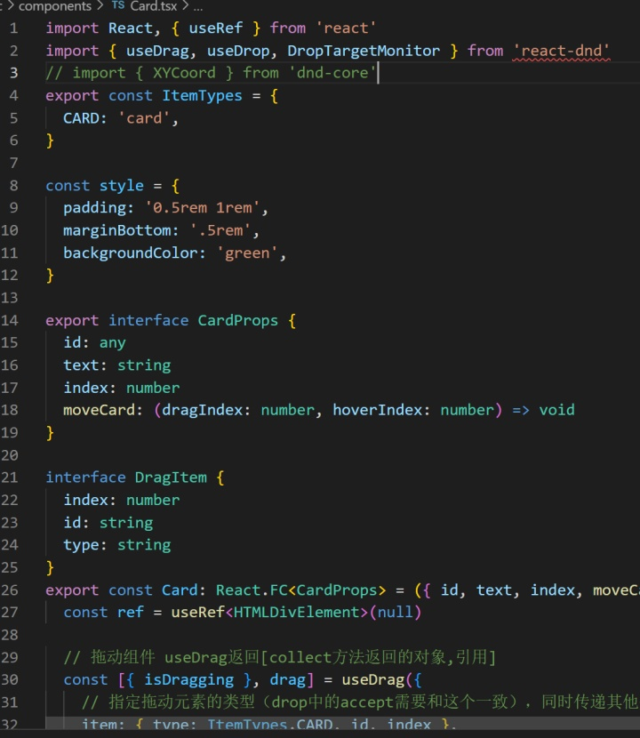

- #### **概念**

React DnD 是一组 React 高阶组件，使用的时候只需要使用对应的 API 将目标组件进行包裹，即可实现拖动或接受拖动元素的功能。将拖动的事件转换成对象中对应状态的形式，不需要开发者自己判断拖动状态，只需要在传入的 spec 对象中各个状态属性中做对应处理即可。

**Manager**

Manager是DnD中非常重要的角色，内部保存了store、monitor和backend，Manager作为入口，对外暴露三者，会订阅store，并调用Backend的setup（负责注册拖拽相关一系列的事件）或teardown（销毁拖拽事件）。

**Backends**

React DnD 抽象了后端的概念，我们可以使用 HTML5 拖拽后端，也可以自定义 touch、mouse 事件模拟的后端实现，后端主要用来抹平浏览器差异，处理 DOM 事件，同时把 DOM 事件转换为 React DnD 内部的 redux action。主要注册了拖拽相关的监听器，对外提供了dom（drag、preview和drop）注入方法。

**Item**

React DnD 基于数据驱动，当拖放发生时，它用一个数据对象来描述当前的元素，比如 { cardId: 25 }。

**Type**

类型是唯一标识应用程序中整个项目类别的字符串（或符号），类似于 redux 里面的 actions types 枚举常量。

**Monitors**

拖放操作都是有状态的，React DnD 通过 Monitor 来存储这些状态并且提供查询。

**Connectors**

Backend 关注 DOM 事件，组件关注拖放状态，connector 可以连接组件和 Backend ，可以让 Backend 获取到 DOM。

**useDrag**

用于将当前组件用作拖动源的钩子。

**useDrop**

使用当前组件作为放置目标的钩子。

- #### **使用**

1. **使组件能够被拖拽（DragSource）：**

使用 DragSource 包裹组件，使其可以被拖动。

 

**参数讲解：**

- *type:* 必填。字符串，ES6符号或返回给定组件的函数props。只有为相同类型注册的 drop targets 才会对此拖动源生成的项目做出反应
- *spec：*必填。一个普通的JavaScript对象，上面有一些允许的方法。它描述了拖动源如何对拖放事件做出反应。
- *collect：*必填。收集功能。它应该返回一个普通的对象注入你的组件。它接收两个参数：connect和monitor。
- *options：*可选的。一个普通的对象。

**spec 对象中的方法**

- *beginDrag(props, monitor, component)：*必填。当拖动开始时，beginDrag 被调用。您必须返回描述被拖动数据的纯 JavaScript 对象。您返回的内容会被放置到 monitor.getItem() 获取到的对象中。
- *endDrag(props, monitor, component)：*可选的。当拖动停止时，endDrag 被调用。对于每个 beginDrag，endDrag 都会对应。
- *canDrag(props, monitor)：* 可选的。用它来指定当前是否允许拖动。如果您想要始终允许它，只需省略此方法即可。注意：您可能无法调用monitor.canDrag() 此方法。
- *isDragging(props, monitor)：* 可选的。默认情况下，仅启动拖动操作的拖动源被视为拖动。注意：您可能无法调用 monitor.isDragging() 此方法。

**方法中的参数 props, monitor, component**

- *props：*当前组件的 props
- *monitor：*一个 DragSourceMonitor 实例。使用它来查询有关当前拖动状态的信息，例如当前拖动的项目及其类型，当前和初始坐标和偏移，以及它是否已被删除。
- *component：*指定时，它是组件的实例。使用它来访问底层DOM节点以进行位置或大小测量，或调用 setState 以及其他组件方法。isDragging、 canDrag 方法里获取不到 component 这个参数，因为它们被调用时实例可能不可用

**collect 中的 connect 和 monitor 参数**

- *connect:* 一个 DragSourceConnector 实例。它有两种方法：dragPreview()和dragSource()。
- *dragSource() => (elementOrNode, options?)：*常用方法，返回一个函数，传递给组件用来将 source DOM 和 React DnD Backend 连接起来
- *dragPreview()：*返回一个函数，传递给组件用来将拖动时预览的 DOM 节点 和 React DnD Backend 连接起来
- *monitor：*一个 DragSourceMonitor 实例。方法如下：

2. **使组件能够放置拖拽组件（DropTartget）：**

使用 DropTarget 包裹组件，使其对拖动、悬停或 dropped的兼容项目做出回应。

 

**参数讲解：**

- *type:* 必填。字符串，ES6符号或返回给定组件的函数props。此放置目标仅对指定类型的 drag sources 项目做出反应
- *spec：*必填。一个普通的JavaScript对象，上面有一些允许的方法。它描述了放置目标如何对拖放事件做出反应。
- *collect：*必填。收集功能。它应该返回一个普通的道具对象注入你的组件。它接收两个参数：connect 和 monitor。
- *options：*可选的。一个普通的对象。

**spec 对象中的方法**

- *drop(props, monitor, component)：* 可选的。在目标上放置兼容项目时调用。可以返回 undefined 或普通对象。如果返回一个对象，它将成为放置结果，可以使用 monitor.getDropResult() 获取到。
- *hover(props, monitor, component)：* 可选的。当项目悬停在组件上时调用。您可以检查 monitor.isOver({ shallow: true }) 以测试悬停是仅发生在当前目标上还是嵌套上。
- *canDrop(props, monitor)：* 可选的。使用它来指定放置目标是否能够接受该项目。如果想要始终允许它，只需省略此方法即可。
- 文档没有提供按目的处理进入或离开事件的方法。而是 monitor.isOver() 从收集函数返回调用结果，以便我们可以使用 componentDidUpdateReact 钩子函数来处理组件中的进入和离开事件。

**方法中的参数 props, monitor, component**

- *props：*当前组件的 props
- *monitor：*一个 DropTargetMonitor 实例。使用它来查询有关当前拖动状态的信息，例如当前拖动的项目及其类型，当前和初始坐标和偏移，是否超过当前目标，以及是否可以删除它。
- *component：*指定时，它是组件的实例。使用它来访问底层DOM节点以进行位置或大小测量，或调用 setState 以及其他组件方法。canDrag 方法里获取不到 component 这个参数，因为它们被调用时实例可能不可用。

**collect 中的 connect 和 monitor 参数**

- *connect:* 一个 DropTargetConnector 实例。它只有一种 dropTarget() 方法。
- *dropTarget() => (elementOrNode)：*常用方法，返回一个函数，传递给组件用来将 target DOM 和 React DnD Backend 连接起来。通过{ connectDropTarget: connect.dropTarget() }从收集函数返回，可以将任何React元素标记为可放置节点。
- *monitor：*一个 DropTargetMonitor 实例。方法如下：

3. #### **DragDropContext & DragDropContextProvider**

使用 DragSource 和 DropTarget 包裹的组件，必须放在： DragDropContext 包裹的根组件内部，或者 DragDropContextProvider 根标签的内部。

**DragDropContext** 

使用 DragDropContext 包装应用程序的根组件以启用 react-dnd。

**参数**

- *backend：*必填。一个 React DnD 后端。除非您正在编写自定义的，否则建议使用 React DnD 附带的 HTML5Backend。
- *context：*backend 依赖。用于自定义后端的上下文对象。例如，HTML5Backend可以为iframe场景注入自定义窗口对象。

**DragDropContextProvider**

作为 DragDropContext 的替代方法，您可以使用 DragDropContextProvider 元素为应用程序启用React DnD。与 DragDropContext 类似，这可以通过 backendprop 注入后端，但也可以注入一个 window 对象。

**参数**

- *backend：*必填。一个 React DnD 后端。除非您正在编写自定义的，否则建议使用 React DnD 附带的 HTML5Backend。

- *context：*backend 依赖。用于自定义后端的上下文对象。例如，HTML5Backend可以为iframe场景注入自定义窗口对象。

  

#### **实战小demo**

1. **创建新项目：npx create-react-app dnd-demo**
2. **配置项目：**
   1. **npm run eject**
   2. **在 babel 中添加 plugins 配置**

1. **在最外层容器 App.js 中添加：**

2. **创建中间组件：**

3. **创建核心组件：**

#### 学习心得与感悟:

今日实现基础react-dnd的实现，React DnD 使用数据而不是视图作为事实的来源。在屏幕上拖动某些内容时，不会说正在拖动组件或DOM节点，而是说正在拖动某种类型的组件。一共有三个组件具有相关使用，分别是最外层容器、中间件Container（数据源和数组交换）、和核心组件Card（使用react-dnd的api）。除此之外，还有react-dnd的相关扩展用法：

- **让组件既可以被拖动也可以接收拖动元素**

（1）使用useRef引入ref：ref = useRef(null)

（2）使用drag和drop包装ref：drag(drop(ref))

（3）将ref变量传给组件

- **drag组件传递数据**

（法1）直接使用item的属性传：item:{type:'Card‘,id:1}

（法2）使用begin方法传值，begin方法的返回值会覆盖item属性，一定要传type属性

drop组件可以在hover或drop方法中的第一个参数获取到，或使用DropTartgetMonitor的getItem()函数获取

- **获取drag组件或drop组件的状态信息，如isOver，isDragging**

drag：collect函数返回的对象会成为useDrag的第一个参数collectProps，可以在组件中直接使用

drop：collect函数返回的对象会成为useDrop的第一个参数collectProps，可以在组件中直接使用