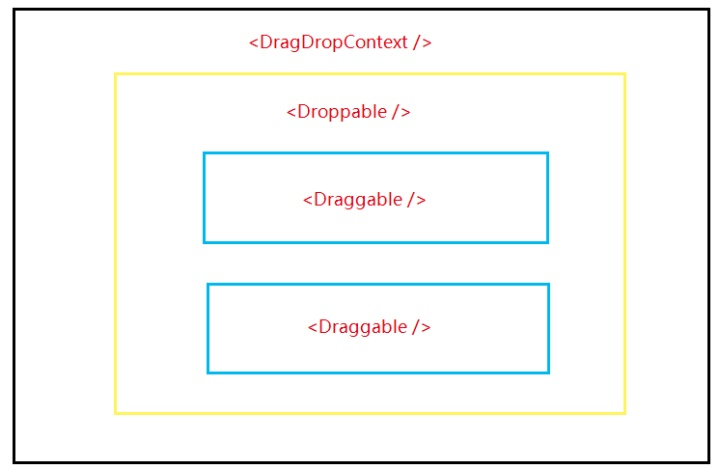
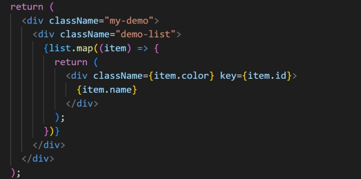
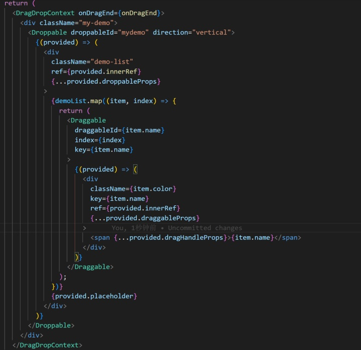
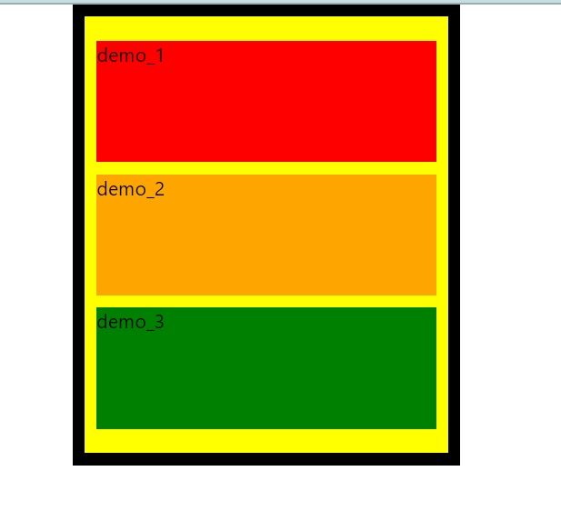
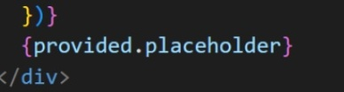

#### 学习困难:

- **结构**
  - **DragDropContext：**构建一个可以拖拽的范围，即最外层包裹拖拽区域的wrap；
  - **Droppable：**某个包含若干个可拖拽元素的组；
  - **Draggable：**可以被拖拽的元素。

- **使用**
  - **引入 react-beautiful-dnd: npm i react-beautiful-dnd**
  - **我的源代码结构：**

- **按照上图改成用拖拽包裹之后：**

可以看到，在最外层的 my-demo 盒子外部套了一层 DragDropContext 作为容器；Droppable 在包裹的map的 demo-list 之外；最内层则是每一个可以被拖拽的元素实例 list ，被 map -> Draggable -> list 层层包裹。

- **注意**

1. **DragDropContext 可选5个函数作为参数**

onBeforeCapture / onBeforeDragStart / onDragStart / onDragUpdate / onDragEnd，其中用户拖拽改变的结果一定要写在 onDragEnd 中，传递改变后的 state 给 react，否则拖拽在松开鼠标后会恢复到拖拽之前的顺序。比如在 onDragEnd 中写重新排序函数，最重要的就是 source + destination，里面有我们原来的位置和拖拽之后的位置，利用这两个index拿到源item并调整目标位置。

2. **Droppable 和 Draggable 结构的 props**

- 第二层结构需要添加 droppableId 和 方向，水平为horizontal，竖直方向为vertical

<Droppable droppableId="mymodal" direction="horizontal">

- 第三层结构需要添加 draggableId 和 index 以及 key，这几个都是用于区分不同项的手段。

draggableId={item.name} index={index} key={item.name}

3. **Droppable和Draggable结构内包的 箭头函数 及 div内的参数**

二层和三层包裹的必须是一个返回原本html结构的函数， provided是官方提供的参    数，里面包含着拖拽一系列参数，事件监听等。

- 第二层 div：

​	ref={provided.innerRef}

​	{…provided.droppableProps}

- 第三层 div：

​	ref={provided.innerRef}

​	{…provided.draggableProps}

​	{…provided.dragHandleProps}

4. **在map结束到 Droppable结束 之间的位置放一个 {provided.placeholder}，用于为拖动的元素占位。**

 

5. **报错：Unable to find draggable with id: xxx**

​	报错原因是因为在 index.js 中 React18 采用了严格模式(<React.StrictMode>)，将其删除就可以拖拽啦。

#### 学习心得与感悟:

昨天学习的 react-dnd 与今天学习的 react-beautiful-dnd 虽然都是制作拖拽组件的三方库，但是却有很大的不同。首先就是API完全不一样，比如 react-dnd 主要用的是 DndProvider、useDrag、useDrop，而 react-beautiful-dnd 主要用的是 DragDropContext、Droppable、Draggable；除此之外，当然就是用法的不一样，react-dnd 相比之下还多了 manager、monitor、collect等等一系列的概念；参数的不同也是他们之间的差别。不过总的来说，我觉得 react-beautiful-dnd 更适合新手，比较容易上手，就是用的人好像不多，踩坑的时候不太好找解决方案；相比之下 react-dnd 的社区可能比较大一点，虽然没那么好上手，但是比较‘专业’。感觉就像 react 和 vue 的区别，一个适合大项目比较好维护、社区人数多，一个适合小项目比较容易上手开发、社区人数少。