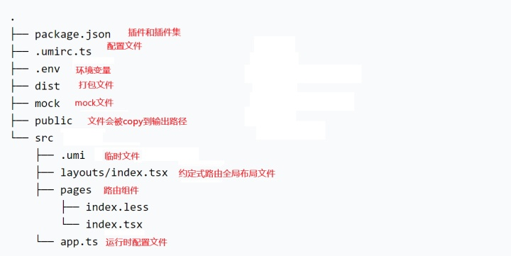
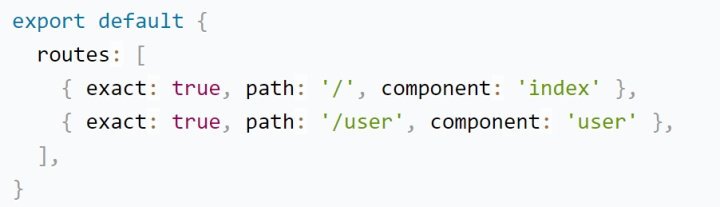
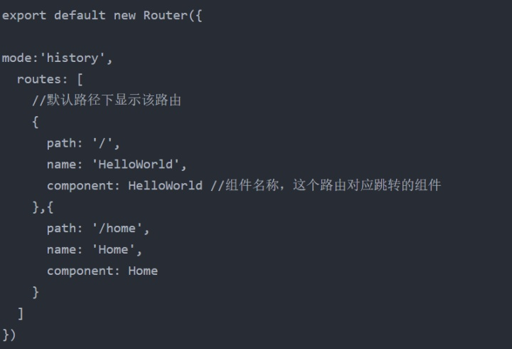
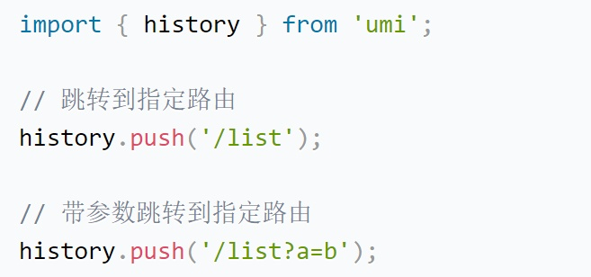
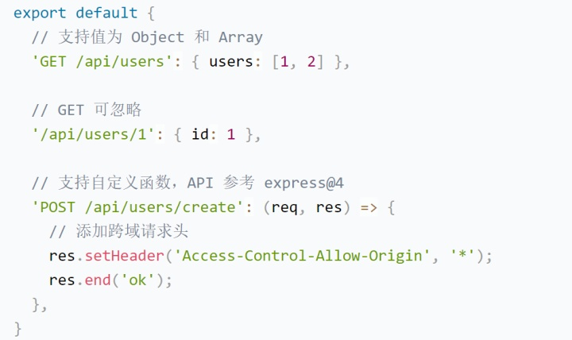

#### Umi框架入门学习笔记

**umi入门介绍：**umi是阿里研发的一个可插拔的react应用框架，是一个方便react开发的前端框架，配置路由、构建、打包部署什么的省了不少事。不过如果你想自己DIY用wbepack打包、配置其他的路由方式什么的就不太适合，因为他相当于为了方便给你统一了流程，就像寄快递一样，可以自己打包好去寄，也可以让菜鸟驿站给你打包，那样可能就根据他们统一的流程，不能自己DIY。

**umi创建项目：**官方推荐是使用yarn，不过你要用npm、cnpm应该也是可以的，然后使用脚手架@umijs/create-umi-app创建项目就行，下载依赖npm i / yarn，启动就npm run start/yarn start。如果需要使用其他的组件库，还需要修改配置：编辑 umirc.ts配置 layout{}+安装组件

**umi项目结构：**快速上手阅读项目必备组织结构指南！学完umi就麻溜看项目

**umi配置：**在umi给的官方文档中，相比于JavaScript，umi其实更支持TypeScript。虽然说JS也已经升级到ES6了，但是TS相对来说会比JS更实用。TS实际上是JS的一个超集，同样支持ES6，可以编译为纯JS，可以运行在任何浏览器上，更适用于开发大型应用。

**umi配置路由：**在umi中配置路由是通过routes进行的，形如

这个形式已经非常接近vue中的路由配置了

- **子路由：**配置子路由时，umi中使用routes中嵌套routes，而vue中使用routes中嵌套children；
- **重定向：**通过redirect:'path'进行重定向，umi和vue一致；
- **路由跳转：**

如果是声明式，umi导入link并在界面使用<link/>;vue则使用<router-link/>进行界面跳转

命令式：umi中的history/hash模式为先导入，然后直接调用

命令式：vue中的history/hash只需要在router.js中声明mode:'history'/'hash'直接配置，跳转路由时使用this.$router.push('path')

- **约定式路由：**约定式路由也叫文件路由，就是不需要手写配置，文件系统即路由，通过目录和文件及其命名分析出路由配置。类似Java中的文件结构，比如必须有个项目文件夹，一个源文件夹，一个包，包下面才能创建Java文件。只要满足这种目录结构，会自动生成包名路径。
- **Mock文件：**umi中mock的用法和vue中基本一致，形如：

使用umi对于 react 项目来说会方便许多，比如 路由、redux 等都有所帮助。