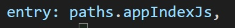
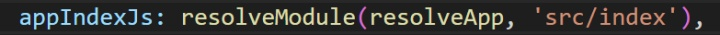
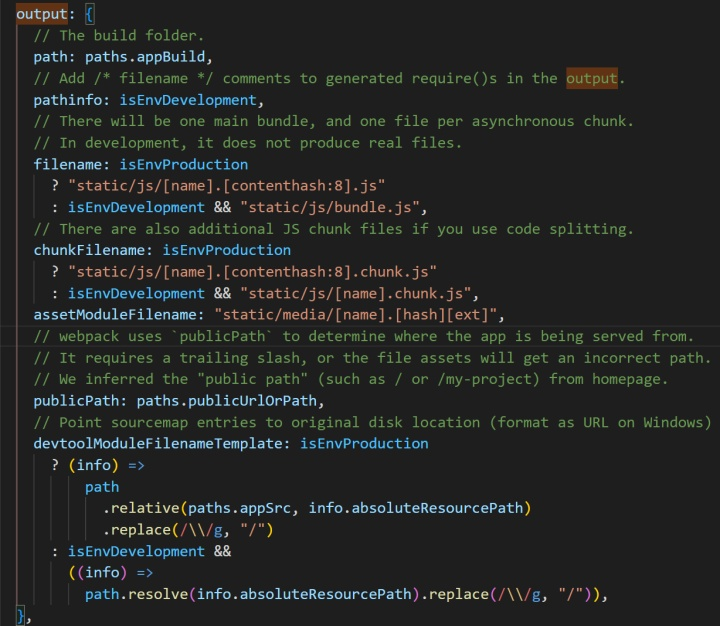
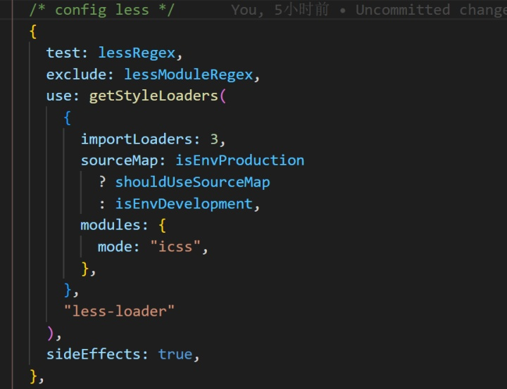
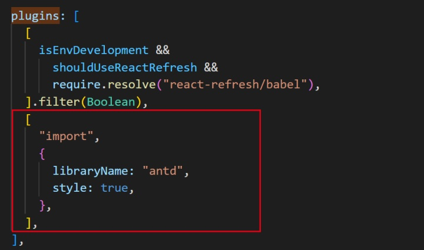
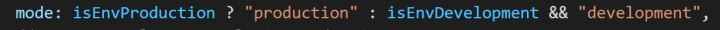

- **学习原因：**

前端本可以直接HTML、CSS、Javascript就行了，不过如果要处理文件依赖、文件合并压缩、资源管理的时候就得利用工具来辅助了。以往有常见的模块化工具RequireJS，SeaJS等，构建工具Grunt、Gulp等，新的技术Sass、React、ES6、Vue等，要在项目中使用这些东西，不用工具的话就略麻烦了。

其实简单地说要聚焦两点：**模块化以及自动构建。**

**模块化可以使用RequireJS来处理依赖，使用Gulp来进行构建；也可以使用ES6新特性来处理模块化依赖，使用webpack来构建。但是相对来说webpack会更好一点。**

- **核心概念**
  - **entry：**webpack用来构建内部依赖图的开始，包含入口起点依赖的模块和库，可以分离应用程序和第三方库入口，常常使用对象语法，我项目的entry如下：

 

- **output：**配置webpack输出文件的位置及名称，一般默认值为"./dist"，也就是运行npm build后再项目文件夹下会多出一个dist文件夹，里面就是项目压缩打包后的静态文件，入口可以有多个，但是输出文件只能有一个。我的项目默认设置的output是这样：

- **loader：**用于对模块的源代码进行转换。loader 可以使你在 import 或"加载"模块时预处理文件。loader 甚至允许你直接在 JavaScript 模块中 import CSS文件。我之前在项目配置less的时候就用到了这个：

- **plugins：**目的在于解决loarder无法实现的其他功能，webpack 自身也是构建于，你在 webpack 配置中用到的相同的插件系统之上。webpack 插件是一个具有 apply 属性的 JavaScript 对象。apply 属性会被 webpack compiler 调用，并且 compiler 对象可在整个编译生命周期访问。比如我就在**/\.(js|mjs|jsx|ts|tsx)$/**这些文件中尝试配置antd来按需加载样式：

- **mode：**提供 mode 配置选项，告知 webpack 使用相应模式的内置优化。取值有两个，**production/development**，默认值是 production。分别用 production 和 development 打包，编译的区别如下：

1、development打包后，一些没有依赖的方法、变量、文件会保留；而 production 则会移除。

2、production 打包后，代码会进行压缩，比 development 的文件小。

我的项目自带的根据需要进行取值：

