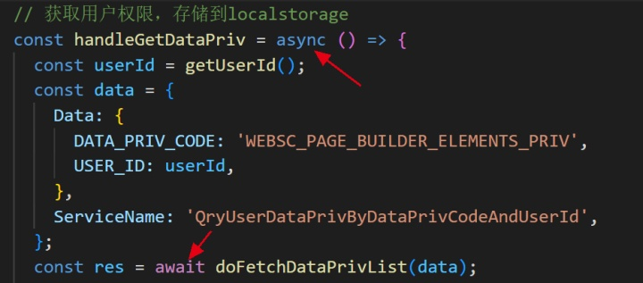

### pageBuilder项目源码阅读①

#### 学习困难:

- **检验eslint**

师傅今天给我他正在做的一个pageBuilder项目，让我阅读学习。师傅怕我这边eslint报错，更新完develop在gitlab拉取代码检查eslint，码一下流程：

- **创建分支**

- **git checkout develop：**切换到远程主分支
- **git pull：**拉取远程仓库主分支的代码
- **git checkout yh：**切换到远程自己的分支
- **git merge develop：**合并远程主分支和自己分支代码
- **git push：**将代码上传到远程仓库自己的分支上

发现了一些代码轻微飘红，但不影响项目运行：

- **项目难点**

如图是此次项目pageBuilder的编辑界面，我们可以拖拽左边的小组件放到中间的展示容器中，通过修改右侧的组件属性值将其打造成自己喜欢的风格。

- **实时渲染**

在右侧修改属性值的时候，数据会进行实时更新，展示容器根据更新后的数据进行实时渲染。

- **数据传递**

在用户选择保存或者发布时，将其更新改造后的展示容器内的组件属性存储到redux中，以JSON数据的形式传递给APP进行接收然后展示在客户端。

- **组件拖拽**

左侧的拖拽用法采用react-dnd实现，舍弃了Drag and Drop。

- **阅读顺序**

因为这个项目，现在文件目录是有点混乱的，多少有点找不到想看的文件在哪，所以问了师傅该怎么阅读。平常上手项目：目录结构->依赖安装->路由跳转->项目运行。师傅建议我这个项目首先看路由，然后把主界面也就是pagelist看一下，之后就是看编辑界面，编辑界面又分为左中右三个部分，左边每一个小图标都是一个独立组件，中间容器负责展示效果，右边的每个子项也都是独立组件，可重用性很高。重头文件就是右边部分以及数据源，也就是每个组件都存储的属性值，很长的一个文件，暂时还没看完。

#### 学习心得与感悟:

今天和师傅沟通了很久，了解了这个项目的受众群体、系统操作、项目难点等等，师傅说这个项目和普通react项目还是有点区别的，毕竟类似于构建一个低代码平台，要求实现用户更改组件属性时，代码内的数据也要相应修改，而且在修改属性之后，要在页面上实时地渲染出来，在vue中实现可以使用监听数据变化，只要数据改变就重新渲染。但在react中没有那么简单，react非常依赖于redux，如果没有redux，也许react就像一只没有翅膀的小鸟，失去了灵魂。不仅要求实时更新与渲染，还需要将用户修改过后的数据存到redux，通过redux存储json数据，最后传递给APP，但是在用户点击返回时，数据恢复成原样，只有在用户保存或者发布的时候，才将数据存储到redux中共享。所以现在纠结的是在用户正在修改属性值的时候，数据要如何保证能够在用户边修改边传递给容器用于展示效果，而不会影响到redux中数据变化。我从今天开始就负责阅读这个项目文件写写注释、充当测试--发现bug的时候给师傅提出来、后期对项目比较了解之后开发一些小组件等。

#### 

### **pageBuilder**项目源码阅读**②**

#### 学习困难:

- **pageList**

主界面中内容列表的文件，使用antd的组件重写样式，包含分页、点击展开、编辑、发布、预览等功能

- **async&&await**

看到这里。有关async和await的知识点有点记不清了，于是去学习了下。

总结起来就是，**async用于声明一个函数为异步处理函数**，除此声明外，函数的写法和同步函数没什么区别，它返回的是一个Promise对象，而Promise是用来干嘛的，他是用于解决异步问题（比如回调地狱）的异步操作的对象，它本身不是异步的，你使用它的时候他会立即执行，但是他会等到你需要的结果才会返回结果；而**await意味着等待一个异步函数的执行结果**，它必须写在async内部，也就是暂停当前async的语句执行，让async先等一下，等到await后面的异步函数执行完后，再继续执行语句。

比如上面截图的执行顺序为先进入async函数执行对象赋值，然后遇到await，等待doFetchDataPrivList(data)执行完成返回结果后，async剩下的语句才会执行。这种等待方式又让我想起来**宏任务和微任务的执行顺序**，比如setTimeout是宏任务，而promise的链式调用内容是微任务（promise本身是立即执行的！），在同步代码中，如果遇到promise的.then方法，将其压入微任务栈，遇到setTimeout压入宏任务栈，在同步代码执行完之后，主栈中没有可执行代码时，先执行微任务栈的可执行代码，然后才执行宏任务栈的可执行代码，如果在执行微任务栈的代码时又有立即执行函数或者同步代码，依旧先执行同步代码，再执行微任务，最后执行宏任务。

- **useAsyncFn**

这个项目的接口请求全部采用这种方式创建，在请求操作方法外层套了一层来自react-use的useAsyncFn钩子用于异步函数的状态管理，相当于react使用redux进行状态管理。useAsync返回的是请求结果及状态，而它返回的是请求函数并非请求结果，需要手动调用的时候再请求。比如下图例子，返回的就是名为doGroupList的请求函数。

- **运算符知识: ?. && ?: && ?? && ``**

在看到pagelist分页函数的时候，发现了一个不知道的es6小知识点

?. 意思是可选链，类似 && ，使用场景：在开发中对接口返回的嵌套对象数据进行属性判断，比如 res ?. data ?. pageList 可以写成 res && res.data && res.data.pageList 或者 res ? (res.data ? res.data.pageList : undefined) : undefined，挨个判断属性是否存在。

?: 意思是可选参数，比如data { id: string | number , key ?: string} 表示key为可选属性，相当于参数自动加上 undefined。

?? 意思是取默认值，类似 || ，使用方法：const res = actualValue ?? defaultValue 也就类似于 actualValue ? actualValue : defaultValue。

`` 比较方便，可以在反引号内部直接写代码，可操作性高了。

#### 学习心得与感悟:

今天看的pagelist文件夹业务逻辑还是比较好理解的，没有涉及到很多像redux一样有好几个不同管理的文件，主要操作就是获取数据、分页、检查权限、接口请求等。整个主界面列表使用的是antd的pageForm、Table等，还有一些自定义组件的使用，明天开始操作界面的代码阅读！

### pageBuilder项目源码阅读③

#### 学习困难:

- **components/editor/schema/edit/customerComponents.tsx**

该文件主要用于存储属性数据，用户可以进行相应修改。

比如我在页面上添加了一个Grapic Article组件，我可以对这个组件进行位置调整、添加图片、添加备注信息等修改，这些修改在用户点击保存或发布时将会被存储到customerComponents中，以便后续传递给APP接收。比如下图就展示了GraphicPost组件的属性，其中header、basicInfo等属于属性的归属，比如title属性就归属于basicInfo，其中 title 也是以公用组件的形式创建的，以key的形式传递给schema，增加代码复用性，提高开发效率。

- **components/editor/schema/fileds/index.tsx**

存储的主要是菜单以及对应左侧内容的数据。比如下图，点击PTO之后左侧可拖拽组件内容会发生改变。

其中DragPanel中的data数据就是组件的所有属性数据，用于发送给APP。

- **components/editor/Left/index.tsx**

左侧容器文件：根据菜单图标激活状态判断，显示展示内容：

- **components/editor/Left/DragItem.tsx**
  - **类型标记**

看到函数参数之间的冒号，有点疑惑，搜索发现是ts语法，表示类型标记，比如：**（args : number）**就代表args被标记为number类型。

- **any & never & void**

 

没有见过的语法，上网搜了一下发现是ts中的类型，除此之外**还有never、void都是TS类型。**

**any：**在一些情况下，如果我们无法确定变量的类型时（或者无需确认类型时），我们可以将其指定为 any 类型。，对于标记为 any 类型的变量，不需要进行类型检查，直接通过编译阶段。**特点：**1. 允许赋值为任意类型； 2. 允许访问任意属性和方法； 3. 在声明变量的时候，如果没有指定变量类型，会被识别为 any 类型。

**never：**表示永远不会有值的一种类型，比如 never 类型是那些总是会抛出异常或根本就不会有返回值的函数表达式或箭头函数表达式的返回值类型。适用于：比如在swtich场景中，我们通常会在结尾添加一个default，但实际上流程进入default就意味着场景已经出错了，所以我们可以在 default 中写 **const check : never = type;** 及时发现问题。

**void：**表示没有任何类型，申明为 void 类型的变量，只能赋予 undefined 和 null。

- **useDrag(☆)**

useDrag提供了一种方式，以让组件成为DnD系统中的拖拽源。通过传递特定的参数，提供需要传递给放置组件的数据（即item），组件渲染所需的props（即collect），以及等等。

**返回值：**

**isDragging：**collecting function的返回值。如果没有collecting function会返回空对象，判断是否在拖拽中，替代原本判断拖拽中的方法。

**dragRef：**拖拽对象的connector函数。

**connectDragPreview：**拖拽预览的connector函数。

**collect:** 会返回一个对象的函数(collecting function)，拥有monitor参数，返回的对象会注入到当前组件中。

通过 isDragging 判断是否在拖拽中，dragRef 绑定拖拽的 item， connectDragPreview 应该是拖拽时的跟随图像：

#### 学习心得与感悟:

今天主要阅读了组件的属性数据、左侧容器的拖拽组件的实现以及一些小的ts知识点。拖拽由子组件使用useDrag实现，猜测父组件（也就是中间容器）应该会是useDrop，useDrag返回三个值，接收之后用包含子组件的div接收绑定，拖拽的组件还有数量限制，需要判断数量、拖拽的状态。目前为止看的代码都能理解，但是需要自己编写的时候应该也没那么容易，可能要费一番功夫思考逻辑以及搭建过程。

### **pageBuilder**项目源码阅读**④**

#### 学习困难:

- **components/editor/canvas/index.tsx**

这个文件主要构建的是组件预览区域：

经常在文件中看到 interface xxx，本来以为可能和 java 开发中的 interface 一样，但看它的实现形式和java还是有很大区别的。java 中的 interface 一般里面都是函数体的定义，用于实现类的多继承；但是 ts 中的 interface 用于对值所具有的结构进行类型检查。

昨天的代码阅读中，看到左侧的小组件每个都绑定了可拖拽属性，使用到useDrag，它们的统一目标就是拖动到中间容器中，所以中间容器需要绑定useDrop。useDrop提供了方式，以让你的组件作为放置对象存在于dnd系统中。通过传递指定参数，以指定接受(accept)的拖拽对象，收集(collect)的属性，等等。第一个返回值为collecting function的返回值，第二个返回值为放置对象的connector函数。其中canDrop、isOver在connect（monitor）进行监听是否可以放置、是否重叠等，同时该容器设置了添加拖拽组件和移除拖拽组件功能。

当拖拽组件和放置容器重合了&&此处可以放置，如果是已经在容器中的组件，拖拽到可放置的位置会出现插入的线条，用于已经放进来的组件调整位置；如果是第一次进容器的组件，拖拽到可放置的位置会出现一个提示盒子：drag and drop here，提示用户可以放置于此。

为了在整个编辑页面都能使用拖拽功能，在editor/index.tsx文件中添加了DndProvider进行页面包裹，类似于Redux中的Provider。

判断用户有没有修改容器的背景属性，比如颜色、尺寸等，如果修改了就使用修改值，没有修改就使用默认值。

看到一个没见过的用法，所有元素的className都写成styles.xxx的样式，问了一下师傅，这是css modules：按需加载，不会造成样式污染，是优化加载的一种方法，局部作用css样式的原理是因为在使用styles.xx之后会自动生成一个独一无二的名字，不会与其他选择器重名。比如在某组件的less文件中设置 .title的样式，在使用 styles.title 之后，在检查元素时发现变成了 ._src_Header_Module_title，完美避免了父组件引用这个组件时，父组件的styles里面也有同名.title从而覆盖子组件样式。

 

- **components/editor/canvas/canvasItem.tsx**

这个文件描述组件拖拽到在中间容器之后的，展示在中间容器上的组件。主要描述了移除、调整、修改该组件的功能，将其与右侧属性相绑定，右侧实时更改，这边就会更新渲染，连接到store保存属性更改。由于canvasItem既需要被拖拽又需要放置，所以在这个文件中useDrag && useDrop都有使用，除此之外还使用了useRef、useAppSelector、useAppDispatch等。用法基本都一样。

#### 学习心得与感悟:

今天阅读了中间容器的文件，基本熟悉了到 react-dnd 的用法，还学习到了 css modules 优化加载，ts 类型检查等。react-dnd 主要 api 就三个，一个设置拖拽源为可拖拽，一个设置放置源为可放置，一个设置区域为允许拖拽放置，可能我的理解有些偏差，我还不太理解 useDrop 到底是作用于拖拽组件上还是放置容器上，我本来的理解是在容器上，但是我又看到 CanvasItem 也使用了 useDrop，我也没找到怎么能把两个组件重叠在一起，所以我对 useDrop 作用的理解就有点开始混乱了。也可能是这个地方有些功能我还没了解到，明天再深入摸清楚这个系统的细节功能。

#### 

### pageBuilder项目源码阅读⑤

#### 学习困难:

- **components/editor/Right/index.tsx**

该文件主要描述编辑界面的右侧属性操作容器，涉及非常多的数据交互与传递。 

开局遇到一个深度遍历的递归函数 traverse(data,fn) ,用于遍历监听所有子值变化。猜测应该用于用户修改属性时，如果发现属性值被修改，就要立即响应，应该类似 diff 算法吧？深度第一遍，从根到叶，子节点按相反的顺序，如果fn返回错误，则终止遍历。

这段函数用来渲染字段，比如说 Graphic Post 组件中属性可能具有 添加标题、插入图片、调整位置等，每一个修改的功能都写成一个小组件，将这些属性小组件存放在界面组件中，传入renderField函数中，renderField函数根据传入的类型遍历渲染，完成右侧属性修改容器的内容填充。

已经搭建好的草稿是可以复制的，复制过来的page一般都要重新设置起始时间以及失效时间。

初始化字段的时候将内容都清空重置，等待用户输入。

用来归纳相似属性的折叠面板渲染，比如说title、Edit 'More'等等属性都归属于 Basic Information，而Basic Information 可以折叠与展开，这个函数就是来绑定折叠面板的header 和 content。

#### 学习心得与感悟:

今天主要阅读了右侧属性面板的index文件，学习到了数据与组件属性相绑定、不同的组件如何遍历渲染构建，判断逻辑找到清空时机等。接下来的阅读目标是：

1. 把右侧的界面组件观看，学会两者之间的连接；
2. 知道添加一个新拖拽组件需要的所有流程；
3. 尝试添加新组件在本地查看。

------

### **pageBuilder项目源码阅读⑥**

#### 学习困难:

**如何实现新组件的添加**

1. **添加组件属性**

根据菜单分类，如果新建组件在CLP内，则将属性添加在customComponents里

 

新建一个组件，需要在editFields中添加组件名及内部属性。比如Toolbar组件，header属于一个属性类别，里面包含自定义属性类，sideMenu属于BasicInfo管辖范围内，使用的是Switch类，根据按钮决定是否展示。不过这个地方已经更新了，尝试注释，结果发现对界面无影响，问师傅说已经重写在render里了，比如BasicInfo重写在renderBasicInfo里，而renderBasicInfo包含renderToolbar，相当于提取出来了。

2. **封装组件属性类别**

目的是提高属性重用性，在将每一个属性种类进行整体封装。先去获取当前版本的数据大json，然后根据type进行分类渲染组件，下面就是根据具体字段渲染具体属性值。比如下面就是轮播图组件的basicInfo封装。

 

3. **定义左侧组件名、图标、数量等**

左侧面板渲染组件时，遍历menus数据，menus中包含DragPanel，存放拖拽组件的容器，涵盖了拖拽组件所需的所有属性数据，传递给DragItem。也就相当于将组件名称、图标、数量全部传递给左侧面板。

4. **创建中间画布**

中间面板，用于预览修改效果，通过canvas实时获取的组件属性实时渲染效果，这个相当于平常写独立组件，‘画’界面。

#### 学习心得与感悟:

非常默契！今天本来也打算看添加新组件所需的步骤，刚好师傅也来让我阅读。不过这个阅读起来还是没有那么简单，还是咨询了师傅关于添加新组件的流程。如上所示，然后师傅说等一阵子可能有个新需求，一个简单的组件可以让我练练手，目前的话就是我明天开始自己写写小demo，仿写一下之前的组件之类的进行项目实战！

### pageBuilder项目源码阅读⑦

#### 学习困难:

**实现添加demo组件（参考Toolbar）**

1. **添加属性**

首先在schema/edit 的customComponents文件中插入新组件 Ydemo 所需的属性：

2. **属性布局**

由于目前暂定是给每个组件改写basicInfo内容，所以要在right/renderBasicInfo中新建一个名为 renderYdemo 的文件，内容为想要的basicInfo内容。如果只是添加了属性是不够的，仅仅是提供了数据，不能在页面上展示。

3. **定义组件**

要将组件数据传递给左侧面板，需要在schema/fields中的 customComponents 文件里添加 Ydemo 的组件名、数量、图标等，还有 Ydemo 中属性的详细数据，比如说我有 messageBox 属性,那么我就还需要 messageBoxId 写在里面，这里的数据会传递给左侧面板以及 renderYdemo 中，比如 basicInfo 中遍历获取属性名就需要用到这里的数据。这里的数据形式为json格式，便于获取和展示数据。

4. **展示组件**

用于中间面板展示组件的，写法类似于之前写独立组件的方法。在 schema/preview中的 customComponents 文件中加入 Ydemo 的方法并导出，在这里面写 Ydemo 的样式：

5. **成果展示**

#### 学习心得与感悟:

今天的任务完成的不是特别困难，但是有一个小问题，关于edit添加属性，如果在edit中没有添加belongTo：‘basicinfo’，在右侧面板中 basicInfo 是空白的，不会展示出来，但只要添了一个属性属于 basicInfo，不管添加的是什么属性，都能够成功展示重写后的 basicinfo 。暂时没弄明白是什么原理，应该所有属性重写都这样，目前是需要添加一个属性给它声明出来，才会展示。

### pageBuilder项目源码阅读⑧

#### 学习困难:

- **可视化楼层文件阅读**

- **components / editor / Floor**
  - **index.tsx**

通过 expanded 状态判断用户是否点击：取消展开，如果点击就只显示展开按钮，否则显示整个楼层。默认为 TRUE。

- **components / editor / TreePanel**

这个文件夹的文件主要是针对拖拽过来的组件，可以将其缩略图标及组件名称以楼层形式展现在画布右侧。

- **index.tsx**

首先将中间画布绑定state数据，其中codeTree是一个 reducer，包含一些选中的标签、id等属性。

绑定 useDrop，使画布具有放置作用，楼层内展示的组件可以拖拽调整组件在画布中的位置。

通过 children 属性，也就是传入的 TreeItem 个数进行遍历展示到界面。

- **TreeItem.tsx**

楼层中如果有 Toolbar ，那么它只能在第一层，所以在这个地方写了有关dataType的判断，不是 Toolbar 的组件才可以进行移动调整楼层。

设置拖拽源，绑定parentId，即组件id：

设置拖拽样式，当拖拽的时候占位透明度变为50%，提示用户目前拖拽的元素原始位置：

 

判断当前位置是否能够放置组件，保证当前位置不属于 isParentNode 的返回标签，就在此生成一条蓝色的线条，代表插入位置线：

#### 学习心得与感悟:

今日阅读的组件有点像 左边面板+中间画布 的组合，因为他既要拖拽也要放置，还需要调整位置，但是整体来说难度并不是很大，pageBuilder了解了拖拽与数据交互之后，所有的文件都大同小异，没有什么特别难的地方，最主要的就是整体的贯通逻辑线，在开发时要做到连成一条线，要有头脑、有设计、有思路的开发。

### pageBuilder项目源码阅读⑨

本来师傅说给一个时间不紧的小单子给我练练手，但我没申请SVN权限，今天申请然后下周开始做，今天就先了解一下数据与视图的交互流程。

#### 学习困难：

- **src / app**

可以看到这个文件夹内的命名都是xxxSlice、xxxReducer，这些文件存储的都是状态管理数据，用于传递给画布视图、App方面。其中最主要的数据都存储在 codeTreeSlice 文件中。

 

- **codeTreeSlice**

初始化数据，默认root div下的背景颜色、背景图。

reducers 中包含多个 actions，用于修改数据。

比如 appendCom() 就是当中间画布上出现新拖入的组件时触发，如果当前拖拽的组件有id，即为新增组件，反之则为移动组件。

   

将 actions 全部打包导出，最后将 reducer仓库整体导出，其他文件就可以引用到这里的actions，从而获取或更新数据。

 

- **Right / render xxx**

这些文件夹内有用于当用户通过右侧属性面板修改属性时，及时将修改传递给 reducers 的文件；

  

比如在之前写的Ydemo中，basicInfo 中的按钮可以给组件右边添加图标，就采用到：

当用户按下按钮时，handleChange()会使 'N' --> 'Y'，得到按钮值变化，下面采用 toolList 去接收focusComponent?.props.extraTool，将它解析成json数据后，再通过 toolList 判断 checked 值，如果确实点击了，将props.extraTool 中的数据也统一改变，最后使用handleChange() 提交修改。它的返回值如下

 

在 Ydemo 为中间画布创建的预览文件中，在 rightRender() 中判断按钮值来决定组件的右侧需要显示什么图标（这是只点击一个按钮的情况）：

使用 getMegSrc() 判断需要展示的图标类型：

最终点击 MessageBox 按钮之后得到的预览效果如下：

#### 学习心得与感悟：

其实 pageBuilder 项目和平常项目的数据交互有点不太一样，平常的项目通常将数据统一放在models文件夹下，像这样（这个应该是umi框架搭的）：

但是 pageBuilder 不太一样，他偏原生：

阅读起来肯定不比普通项目方便。包括p ageBuilder 的项目文件其实都是有点混乱的，毕竟开发时间久远，开发人员也不多，至此为止 pageBuilder 项目源码阅读应该就到此为止啦！收获挺多的，包括数据交互、数据传递、组件拖拽等等，也学到了挺多东西的！