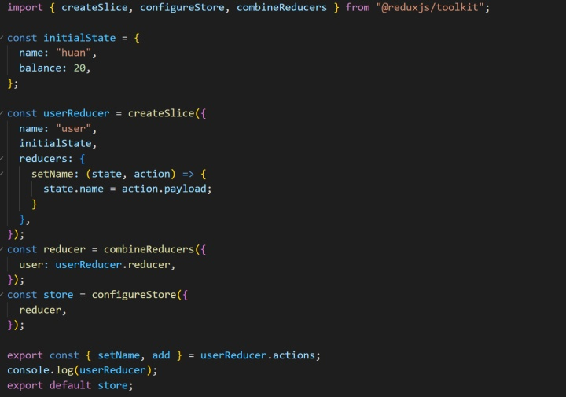
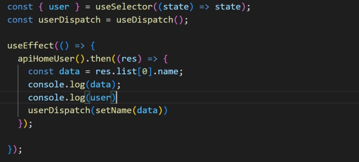
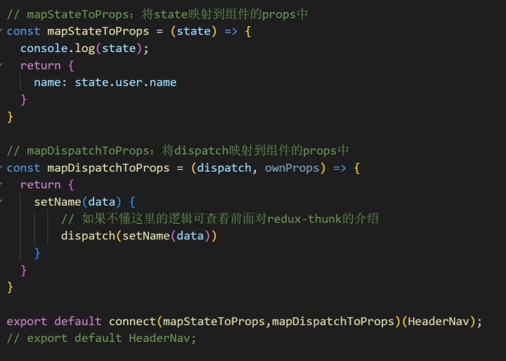

#### redux学习

在应用中所有的 state 都以对象树的形式储存在单一的 store 中。惟一改变 state 的办法是触发 action，一个描述发生什么的对象。 为了描述 action 如何改变 state 树，需要用到 reducers。

- **store**

在我们使用脚手架搭建项目的时候默认是没有store的，它是由我们手动在项目的src目录下创建的一个保存数据的store文件夹。redux之前是使用 createStore，目前是使用 configureStore这个官方API用来生成store。

​	**store 的三大原则：**

​		*单一数据源：*整个应用的 state 被储存在一棵 object 树中，并且这个 object 树只存在于唯一一个 store 中；

​	*State 是只读的：*唯一改变 state 的方法就是触发 action，action 是一个用于描述已发生事件的普通对象；

​	*使用纯函数来执行修改：*为了描述 action 如何改变 state 树 ，需要定义 reducers。

- **reducer**

简单来说 reducer 是一个纯函数，什么是纯函数？就是相同的输入必定有相同的输出，就叫做纯函数。**reducer 作用就是用来改变 store 中的数据。**定义reducer需要两个参数，分别是当前需要被共享的 state 以及用于改变 state 的 action。

- **action**

action我们可以理解为是一种改变数据的触发行为，**作用就是通知reducer改变哪一条数据；**

#### **react-redux学习**

本来看的是原生redux，但是 redux 在 react 不好使用。React-Redux 是 Redux 的官方React绑定库。它能够使 React 组件从 Redux store 中读取数据，并且向 store 分发 actions 以更新数据。用原生redux和react结合使用的时候，每次都要载入 store，而且派发完 action 修改数据后还要调用 subscribe 去监听，在监听里更新事件，React-Redux 规避了这些麻烦。

**React-Redux的三个关键作用**

- 通过 Provider 把 state 注入到全局
- 通过 connect 把 state 和 dispatch 注入到当前组建的 props 上
- 响应式

React-Redux 提供一个 connect 方法能够把组件和 store 连接起来，把 state，dispatch 方法，捏合到当前组件上。connect 有两个参数，两参数都是函数，参数在 connect 内部被调用，参数内能拿到state和dispatch。

#### 实战Demo

- **把store/reducer/actions结合放在一个文件进行测试**

- **store 使用**
  - **home.js**

- **headerNav.js**

- **使用细节**

1. 异步请求可以写在页面也可以写在action里，用法可能会有点轻微不一样；
2. 使用父子传值会比connect连接便捷一点，可以直接获取父组件的值，不过如果组件嵌套，使用connect能直接获取到store里的值，connect相当于提供一个方法使所有组件可以直接连接到仓库；
3. 使用父子传值时需要在父组件引用子组件的时候传递一对键值，如**<headerNav name={user.name} />**；在用connect获取值的时候使用不需要键值，props里会自带，因为**mapStateToProps**已经解决了。

#### 学习心得与感悟:

今天和师傅找了很久bug，哈哈找的最久的就是最开始报错说我写的action函数不是函数，我打印了一下确实是undefined，最后发现是reducers属性我少打了个s，真的蛮搞笑的T_T 。新版本不支持createStore，但是很多教程里都是使用的createStore，应该使用configureStore，但是这个的用法和createStore有点区别，所以也报错。找到configureStore问题之后，好像都会搭配使用createSlice，这两个与createStore相比首先来源不一样，**createStore来源react-redux，configureStore来源@reduxjs/toolkit**，configureStore封装了一些东西，简单来说就是使用起来会比较方便，毕竟更新不能往复杂了更吧。